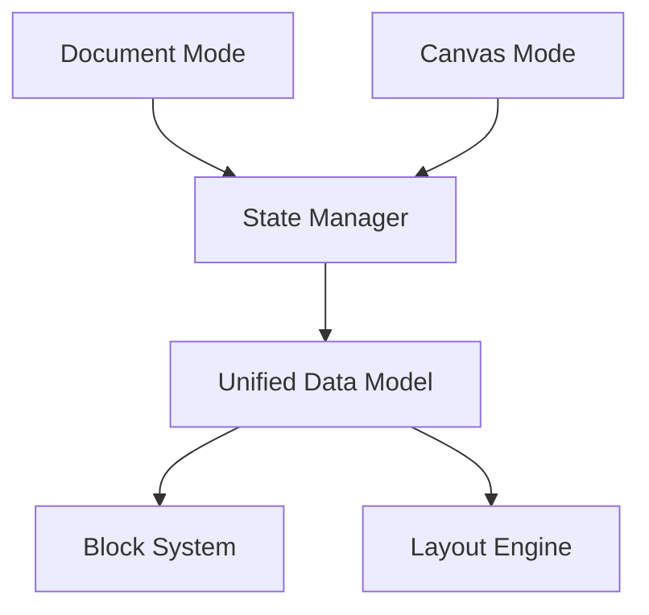

# Système de Basculement Document/Canvas

## 1. Analyse du Système AFFiNE

### 1.1 Architecture de Basculement


### 1.2 Modèle de Données Unifié
```typescript
interface UnifiedDataModel {
  // Structure de base
  content: {
    blocks: Block[]
    relations: Relation[]
    metadata: Metadata
  }
  
  // Modes de visualisation
  views: {
    document: DocumentView
    canvas: CanvasView
  }
  
  // État partagé
  shared: {
    selection: Selection
    cursor: Cursor
    history: EditHistory
  }
}
```

## 2. Préparation de Notre Architecture

### 2.1 Système de Blocs Universel
```typescript
interface UniversalBlock {
  // Propriétés communes
  id: string
  type: BlockType
  content: any
  
  // Rendu contextuel
  render: {
    // Mode document
    toDocument(): DocumentNode
    // Mode canvas
    toCanvas(): CanvasNode
  }
  
  // Position et taille
  layout: {
    // Mode document
    documentFlow: {
      order: number
      indent: number
    }
    // Mode canvas
    canvasPosition: {
      x: number
      y: number
      width: number
      height: number
    }
  }
}
```

### 2.2 Gestionnaire de Mode
```typescript
class ViewModeManager {
  // État du mode
  private currentMode: 'document' | 'canvas'
  
  // Transitions
  async switchMode(newMode: 'document' | 'canvas') {
    // 1. Sauvegarde état actuel
    const currentState = await this.saveCurrentState()
    
    // 2. Préparation nouveau mode
    await this.prepareMode(newMode)
    
    // 3. Transition
    await this.executeTransition(currentState, newMode)
    
    // 4. Post-transition
    await this.finalizeTransition(newMode)
  }
  
  // Gestion état
  private async saveCurrentState() {
    return {
      scroll: this.getScrollPosition(),
      selection: this.getSelection(),
      viewport: this.getViewport()
    }
  }
  
  // Animation
  private async executeTransition(state: State, newMode: Mode) {
    // Animation fluide
    await this.animator.animate({
      from: state,
      to: this.calculateTargetState(state, newMode),
      duration: 300,
      easing: 'easeInOutCubic'
    })
  }
}
```

### 2.3 Système de Layout Adaptatif
```typescript
interface AdaptiveLayout {
  // Calcul layout
  layout: {
    // Mode document
    computeDocumentLayout(blocks: Block[]): DocumentLayout
    
    // Mode canvas
    computeCanvasLayout(blocks: Block[]): CanvasLayout
    
    // Transition
    computeTransitionLayout(
      from: Layout,
      to: Layout,
      progress: number
    ): Layout
  }
  
  // Contraintes
  constraints: {
    document: {
      flow: FlowConstraints
      margins: Margins
      spacing: Spacing
    }
    canvas: {
      bounds: Bounds
      grid: Grid
      zoom: Zoom
    }
  }
}
```

## 3. Intégration avec les Bases de Données

### 3.1 Rendu Contextuel des Bases
```typescript
interface DatabaseBlockRenderer {
  // Rendu base de données
  renderModes: {
    // Vue document
    document: {
      inline(): InlineView
      expanded(): ExpandedView
      collapsed(): CollapsedView
    }
    
    // Vue canvas
    canvas: {
      card(): CardView
      table(): TableView
      board(): BoardView
    }
  }
  
  // Interactions
  interactions: {
    // Commun
    edit(data: any): void
    filter(criteria: FilterCriteria): void
    
    // Spécifique canvas
    resize(size: Size): void
    move(position: Position): void
    connect(target: Block): void
  }
}
```

### 3.2 Synchronisation des Vues
```typescript
class ViewSynchronizer {
  // Sync bidirectionnelle
  sync: {
    // Document vers Canvas
    documentToCanvas(block: Block): void
    
    // Canvas vers Document
    canvasToDocument(block: Block): void
    
    // Temps réel
    realtime: {
      onDocumentChange(callback: ChangeCallback): void
      onCanvasChange(callback: ChangeCallback): void
    }
  }
  
  // Résolution conflits
  conflicts: {
    detectConflicts(changes: Change[]): Conflict[]
    resolveConflict(conflict: Conflict): Resolution
  }
}
```

## 4. Préparation pour Fonctionnalités Futures

### 4.1 Architecture Extensible
```typescript
interface ExtensibleSystem {
  // Points d'extension
  extensions: {
    // Nouveaux types de blocs
    registerBlockType(type: BlockType): void
    
    // Nouveaux modes de vue
    registerViewMode(mode: ViewMode): void
    
    // Nouveaux renderers
    registerRenderer(renderer: Renderer): void
  }
  
  // Hooks système
  hooks: {
    onModeSwitch: Hook<ModeSwitch>
    onLayoutChange: Hook<LayoutChange>
    onBlockTransform: Hook<BlockTransform>
  }
}
```

### 4.2 Support Multi-vue
```typescript
interface MultiViewSupport {
  // Gestion des vues
  views: {
    // Vues standard
    document: DocumentView
    canvas: CanvasView
    
    // Vues futures
    timeline?: TimelineView
    mindmap?: MindMapView
    calendar?: CalendarView
  }
  
  // Transitions
  transitions: {
    register(from: ViewType, to: ViewType, transition: Transition): void
    execute(from: ViewType, to: ViewType, context: Context): Promise<void>
  }
}
```

## 5. Recommandations d'Implémentation

1. **Phase 1 : Fondation**
   - Implémentation du modèle de données unifié
   - Système de blocs de base
   - Transitions simples

2. **Phase 2 : Bases de Données**
   - Intégration du rendu contextuel
   - Synchronisation des vues
   - Interactions de base

3. **Phase 3 : Canvas Avancé**
   - Connexions visuelles
   - Automatisations
   - Layouts complexes

4. **Phase 4 : Optimisation**
   - Performance des transitions
   - Gestion mémoire
   - UX raffinée

Cette architecture permet de :
1. Préparer le terrain pour le basculement document/canvas
2. Maintenir la cohérence des données
3. Supporter les fonctionnalités futures
4. Assurer une expérience utilisateur fluide
